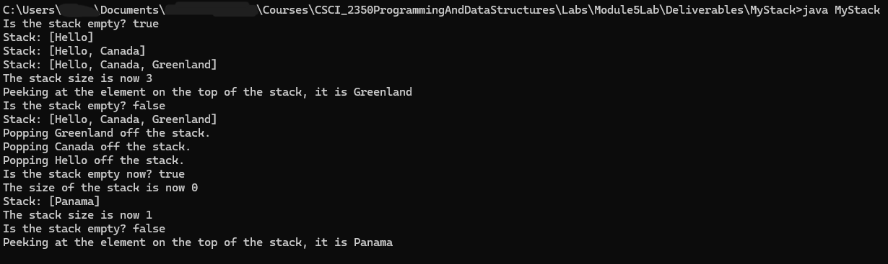

# MyStack
MyStack uses a custom MyArrayList that extends AbstractList and implements a List interface to create a stack by composition and utilizes generics.

## Table of contents
* [General Info](#General-info)
* [Author](#Author)
* [Programming Approaches](#Programming-approaches)
* [Techologies](#Technologies)
* [Setup](#Setup)
* [Usage](#Usage)
* [Minimum hardware requirements](#Minimum-hardware-requirements)
* [Screenshots](#Screenshots)
* [Project status](#Project-status)
* [Release date](#Release-date)
* [Works Cited](#Works-Cited)
* [Acknowledgements](#Acknowledgements)
* [Contact](#Contact)
* [Disclaimer](#Disclaimer)

## General info
- MyStack utilizes a custom MyArrayList with generics to create a stack by composition (instead of inheriting directly from the MyArrayList class).
- The main() method tests the stack by creating a MyStack object that stores the String data type and testing the push(), peek(), isEmpty(), toString(), size(), and pop() methods.
- This was part of Lab 5 in my Java Programming and Data Structures course.

## Author
- Jason Ash, Computer Science Major

## Programming approaches
- I came up with the Stack interface and the MyStack class on my own after reading the respective section in our textbook (Liang, 2024).
- The MyStack implementation uses an internal MyArrayList since pushing and popping happen at the end of the ArrayList (the top of the stack).
- So, an ArrayList is a more efficient data structure to use in creating a stack than a LinkedList since interaction with the stack only happens at the top of that stack, and the operations that MyStack supports are O(1) with a backing ArrayList vs O(n) with a singly-linked LinkedList.
- My implementation for List, AbstractList, and MyArrayList closely follows what is in our textbook (Liang, 2024) since they use generics but not Comparable or an iterator.
- MyArrayList methods are called within the methods for MyStack for it to accomplish its tasks.
- For example, the MyArrayList add() method is used to push() objects onto the stack, the MyArrayList remove(size -1) method is used to pop() objects from the stack, etc.
- I also followed a suggestion in the third chapter on sorted and unsorted lists in *Object-Oriented Data Structures* by N. Dale, D.T. Joyce, and C. Weems on returning a copy of the object that was gotten or removed from a list to ensure information hiding and better encapsulation.
- Since the program uses generics (which is a beneficial programming technique), the compiler will complain that MyStack.java uses unchecked or unsafe operations (which is just its way of saying it cannot guarantee type casting of objects into their actual type, such as String).
- There is no way to prevent or suppress this message when using generics, but Java bytecode is still compiled into classes within the directory that MyStack.java is saved to, and the program can still be run with the javac command.

## Technologies:
I wrote the source code in Notepad in Windows 11, compiled it in the Command Prompt using the javac command, and ran it using the java command.

## Setup
To compile these .java files into Java bytecode, you can use the command line like I did or your favorite IDE of choice.

## Usage
- Type java MyStack in the command line after compiling it, and the output should be the same as the screenshot below.

## Minimum hardware requirements
- Although I developed this on a fairly recent Windows 11 PC, this program should run comfortably on any working computer with sufficient processing power, RAM, a monitor manufactured within the past 15-20 years, and an Internet connection to download the .java source files.
- I used JDK version 21 to compile this source code, so your computer will have to be capable of installing and running that version of the JDK and its corresponding built-in JRE.

## Screenshots

## Project status
- This program met or exceeded the requirements for this part of Lab 5, so I'm releasing my solution on GitHub.

## Release date
19 Aug, 2026

## Works Cited
- Dale, Nell, Joyce, Daniel T., and Weems, Chip. Object-Oriented Data Structures Using Java. Jones and Bartlett Learning, 2002.

- Liang, Y. Daniel. Introduction to Java Programming and Data Structures. 13th ed., Pearson Education Limited, 2024.

## Acknowledgements
- Prof. Dr. Ibrahim AL-Agha is the project advisor.

## Contact
Jason Ash - wizardofki@gmail.com

## Disclaimer
MyStack.java is released under the GNU Public License 3.0. This software and source code are expressly provided "AS IS." I (Jason Ash) MAKE NO WARRANTY OF ANY KIND, EXPRESS, IMPLIED, IN FACT, OR ARISING BY OPERATION OF LAW, INCLUDING, WITHOUT LIMITATION, THE IMPLIED WARRANTY OF MERCHANTABILITY, FITNESS FOR A PARTICULAR PURPOSE, NON-INFRINGEMENT, AND DATA ACCURACY. I NEITHER REPRESENT NOR WARRANT THAT THE OPERATION OF THE SOFTWARE WILL BE UNINTERRUPTED OR ERROR-FREE, OR THAT ANY DEFECTS WILL BE CORRECTED. I DO NOT WARRANT OR MAKE ANY REPRESENTATIONS REGARDING THE USE OF THE SOFTWARE OR THE RESULTS THEREOF, INCLUDING BUT NOT LIMITED TO THE CORRECTNESS, ACCURACY, RELIABILITY, OR USEFULNESS OF THE SOFTWARE.
